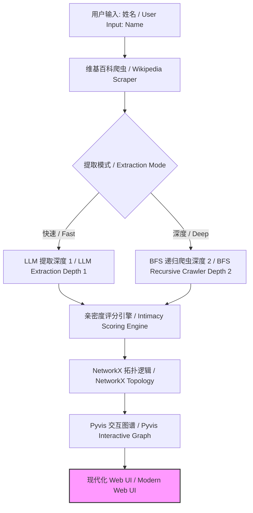

# 🎭 名人关系图谱 | Celebrity Relations Graph

<p align="center">


</p>

<p align="center">
<strong>一款基于大语言模型和广度优先搜索，自动提取并可视化社交网络的开源情报 (OSINT) 工具。</strong>


<em>An automated OSINT tool to extract and visualize social networks using Large Language Models and Breadth-First Search.</em>
</p>

## 🌟 项目概览 | Overview

**名人关系图谱 (Celebrity Relations Graph)** 是一个智能管道，旨在绘制公众人物复杂的社交网络。通过利用 **大语言模型 (LLM)** 进行实体关系提取，并结合 **广度优先搜索 (BFS)** 进行多跳发现，它将非结构化的传记文本转化为高保真、交互式的知识图谱。

该工具超越了简单的关键词匹配，利用 AI 理解人际关系的细微差别和亲密程度。

> **Celebrity Relations Graph** is an intelligent pipeline designed to map the intricate social networks of public figures. By leveraging **Large Language Models (LLM)** for entity-relation extraction and **Breadth-First Search (BFS)** for multi-hop discovery, it transforms unstructured biography text into high-fidelity, interactive knowledge graphs.

## 🚀 核心特性 | Key Features

* **🧠 智能提取 | Intelligent Extraction**: 深度解析非结构化文本，利用尖端 LLM 识别 `(主体, 关系, 客体)` 三元组。

* **❤️ 亲密度评分 | Intimacy Scoring**: 专有的 LLM 驱动启发式算法（1-10 级）量化关系亲密度（例如，家人：10，熟人：2）。

* **🕸️ 动态爬虫 | Dynamic Crawler**: 支持多跳深度（“快速” vs “深度”模式）以揭示“网络背后的网络”。

* **🎨 磨砂玻璃 UI | Glassmorphism UI**: 现代化的、基于物理模拟的可视化看板，支持实时日志流展示。

## 🆕 最新技术更新 | Recently Updated

### 1. 多源搜索回退机制 | Multi-Source Search Fallback

* **DuckDuckGo 集成**: 如果维基百科提取失败，系统会自动回退到使用 `duckduckgo-search` 进行网页搜索，采集传记片段。

* **鲁棒性**: 确保即使是冷门名人也能生成图谱。

### 2. 智能错误处理 | Intelligent Error Handling

* **内容过滤绕过**: 自动检测 AI 内容政策违规（Error 400）并切换到更安全的备用数据源。

* **用户反馈**: 当所有尝试后仍无数据时，UI 会显示更清晰的错误提示。

### 3. 视觉亲密度引擎 | Visual Intimacy Engine

* **动态连线**: 连线粗细 (1px - 9px) 根据亲密度评分 (1-10) 动态缩放。

* **物理调优**: 关系越亲密，在图谱布局中会被拉得越近，从而形成直观的视觉层级。

## 🏗️ 技术架构 | Technical Architecture



## 🔧 快速入门 | Getting Started

### 1. 安装 | Installation

```bash
git clone https://github.com/zytjmy1/CelebrityRelationsGraph.git
cd CelebrityRelationsGraph
pip install -r requirements.txt
```

### 2. 配置 | Configuration

在根目录创建 `.env` 文件 / Create a `.env` file in the root directory:

```env
OPENAI_API_KEY=your_api_key_here
OPENAI_BASE_URL=[https://api.openai.com/v1](https://api.openai.com/v1)
# 设置输出语言 / Set output language
DEFAULT_LANGUAGE=zh
```

### 3. 使用 | Usage

启动 Web 服务器 / Start the web server:

```bash
python src/app.py
```

访问 `http://localhost:8000` 开始探索。

## 📊 搜索模式对比 | Search Modes

| 特性 | 快速模式 (深度 1) | 深度模式 (深度 2) | 
| ----- | ----- | ----- | 
| **搜索范围 / Scope** | 仅目标个人 | 目标 + 顶级连接人物 | 
| **LLM 负载 / Workload** | 低 (~1-2 次调用) | 高 (N+1 递归调用) | 
| **发现能力 / Discovery** | 直接亲属与朋友 | “朋友的朋友” / 隐藏链接 | 
| **响应速度 / Latency** | 即时 (< 10s) | 顺序执行 (30s - 2min) | 

<p align="center"> Designed with ❤️ for the OSINT Community </p>