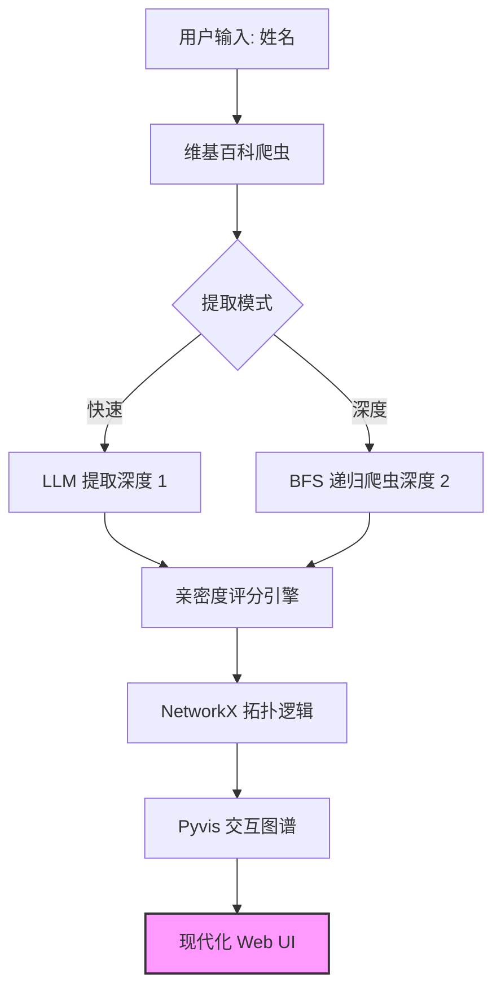
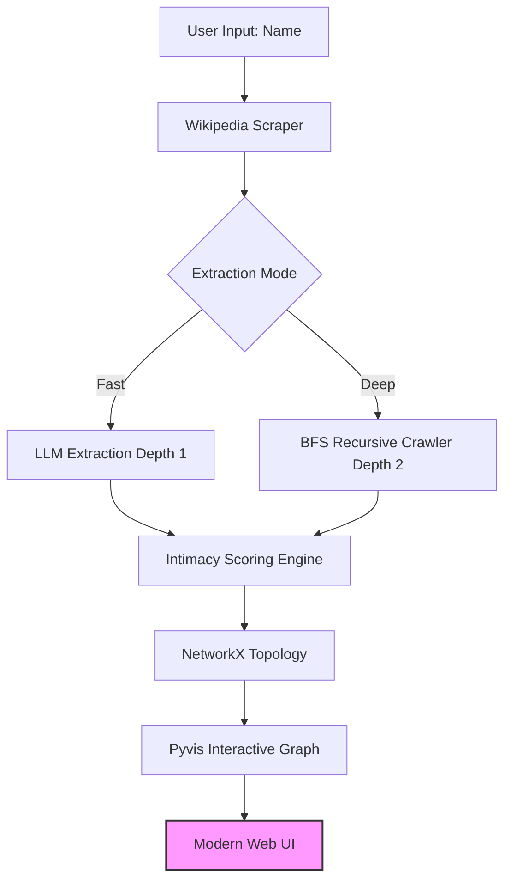

# 🎭 名人关系图谱｜Celebrity Relations Graph

<p align="center">
  <a href="#简体中文">简体中文</a> | <a href="#english">English</a>
</p>

<p align="center">
  
  
  
  
</p>

---

<h2 id="简体中文">🇨🇳 简体中文</h2>

<p align="center">
  <strong>一款基于大语言模型和广度优先搜索，自动提取并可视化社交网络的开源情报 (OSINT) 工具。</strong>
</p>

### 🌟 项目概览

**Celebrity Relations Graph** 是一个智能管道，旨在绘制公众人物复杂的社交网络。通过利用 **大语言模型 (LLM)** 进行实体关系提取，并结合 **广度优先搜索 (BFS)** 进行多跳发现，它将非结构化的传记文本转化为高保真、交互式的知识图谱。

该工具超越了简单的关键词匹配，利用 AI 理解人际关系的细微差别和亲密程度。

### 🚀 核心特性

- **🧠 智能提取**：深度解析非结构化文本，利用尖端 LLM 识别 `(主体, 关系, 客体)` 三元组。
- **❤️ 亲密度评分**：专有的 LLM 驱动启发式算法（1-10 级）量化关系亲密度（例如，家人：10，熟人：2）。
- **🕸️ 动态爬虫**：支持多跳深度（“快速” vs “深度”模式）以揭示“网络背后的网络”。
- **🎨 磨砂玻璃 UI**：现代化的、基于物理模拟的可视化看板，支持实时日志流展示。

### 🆕 最新技术更新

1. **多源搜索回退机制**：如果维基百科提取失败，系统会自动回退到使用 `duckduckgo-search` 进行网页搜索。
2. **智能错误处理**：自动检测 AI 内容政策违规（Error 400）并切换到更安全的备用数据源。
3. **视觉亲密度引擎**：连线粗细 (1px - 9px) 根据亲密度评分 (1-10) 动态缩放。

### 🏗️ 技术架构



### 🔧 快速入门

#### 1. 安装
```bash
git clone [https://github.com/your-username/celebrity-relations-graph.git](https://github.com/your-username/celebrity-relations-graph.git)
cd celebrity-relations-graph
pip install -r requirements.txt
```

#### 2. 配置
在根目录创建 `.env` 文件：
```env
OPENAI_API_KEY=your_api_key_here
OPENAI_BASE_URL=[https://api.openai.com/v1](https://api.openai.com/v1)
DEFAULT_LANGUAGE=zh
```

#### 3. 使用
启动 Web 服务器：
```bash
python src/app.py
```

---

<h2 id="english">🇺🇸 English</h2>

<p align="center">
  <strong>An automated OSINT tool to extract and visualize social networks using Large Language Models and Breadth-First Search.</strong>
</p>

### 🌟 Overview

**Celebrity Relations Graph** is an intelligent pipeline designed to map the intricate social networks of public figures. By leveraging **Large Language Models (LLM)** for entity-relation extraction and **Breadth-First Search (BFS)** for multi-hop discovery, it transforms unstructured biography text into high-fidelity, interactive knowledge graphs.

### 🚀 Key Features

- **🧠 Intelligent Extraction**: Deeply parses unstructured text to identify `(Subject, Relation, Object)` triplets.
- **❤️ Intimacy Scoring**: A proprietary LLM-driven heuristic (scale 1-10) to quantify relationship closeness.
- **🕸️ Dynamic Crawler**: Supports multi-hop depth ("Fast" vs "Deep" mode).
- **🎨 Glassmorphism UI**: A modern, physics-based visualization dashboard.

### 🆕 Recently Updated Technologies

1. **Multi-Source Search Fallback**: Automatically falls back to DuckDuckGo if Wikipedia fails.
2. **Intelligent Error Handling**: Automatically bypasses AI content filters.
3. **Visual Intimacy Engine**: Edges dynamically scale in thickness (1px - 9px) based on intimacy.

### 🏗️ Technical Architecture



### 🔧 Getting Started

#### 1. Installation
```bash
git clone [https://github.com/your-username/celebrity-relations-graph.git](https://github.com/your-username/celebrity-relations-graph.git)
cd celebrity-relations-graph
pip install -r requirements.txt
```

#### 2. Configuration
Create a `.env` file:
```env
OPENAI_API_KEY=your_api_key_here
OPENAI_BASE_URL=[https://api.openai.com/v1](https://api.openai.com/v1)
DEFAULT_LANGUAGE=en
```

#### 3. Usage
```bash
python src/app.py
```

---

<p align="center"> Designed with ❤️ for the OSINT Community </p>