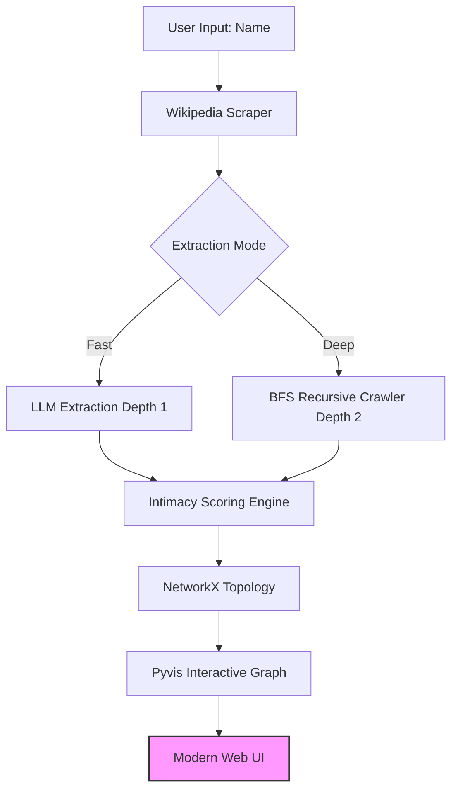

# 🎭 Celebrity Relations Graph

<p align="center">
  
  
  
  
</p>

<p align="center">
  <strong>An automated OSINT tool to extract and visualize social networks using Large Language Models and Breadth-First Search.</strong>
</p>

---

## 🌟 Overview

**Celebrity Relations Graph** is an intelligent pipeline designed to map the intricate social networks of public figures. By leveraging **Large Language Models (LLM)** for entity-relation extraction and **Breadth-First Search (BFS)** for multi-hop discovery, it transforms unstructured biography text into high-fidelity, interactive knowledge graphs.

This tool goes beyond simple keyword matching by using AI to understand the *nuance* and *intimacy* of relationships.

## 🚀 Key Features

- **🧠 Intelligent Extraction**: Deeply parses unstructured text to identify `(Subject, Relation, Object)` triplets using state-of-the-art LLMs.
- **❤️ Intimacy Scoring**: A proprietary LLM-driven heuristic (scale 1-10) to quantify relationship closeness (e.g., Family: 10, Acquaintance: 2).
- **🕸️ Dynamic Crawler**: Supports multi-hop depth ("Fast" vs "Deep" mode) to uncover the "Network behind the Network".
- **🎨 Glassmorphism UI**: A modern, physics-based visualization dashboard featuring real-time log streaming.

## 🆕 Recently Updated Technologies

### 1. Multi-Source Search Fallback
- **DuckDuckGo Integration**: If Wikipedia extraction fails (e.g., page not found), the system automatically falls back to a web search using `duckduckgo-search` to gather biography snippets.
- **Robustness**: Ensures graph generation even for niche celebrities or when direct URLs fail.

### 2. Intelligent Error Handling
- **Content Filter Bypass**: Automatically detects AI content policy violations (Error 400) and switches to safer fallback data sources.
- **User Feedback**: clearer error messages in the UI when no data is available after all attempts.

### 3. Visual Intimacy Engine
- **Thickened Connections**: Edges now dynamically scale in thickness (1px - 9px) based on the intimacy score (1-10).
- **Physics Tuning**: Closer relationships are physically pulled tighter together in the graph layout for immediate visual hierarchy.

## 🏗️ Technical Architecture

The system follows a modular design pattern to ensure scalability and extraction accuracy:



## 🔧 Getting Started

### 1. Installation

```bash
git clone https://github.com/your-username/celebrity-relations-graph.git
cd celebrity-relations-graph
pip install -r requirements.txt
```

### 2. Configuration

Create a `.env` file in the root directory:

```env
OPENAI_API_KEY=your_api_key_here
OPENAI_BASE_URL=https://api.openai.com/v1
# Optional: Set language to 'zh' for Chinese output
DEFAULT_LANGUAGE=en
```

### 3. Usage

Start the web server:

```bash
python src/app.py
```

Visit `http://localhost:8000` to start exploring.

## 📊 Search Modes

| Feature | Fast Mode (Depth 1) | Deep Mode (Depth 2) |
| :--- | :--- | :--- |
| **Search Scope** | Target individual only | Target + Top-tier connections |
| **LLM Workload** | Low (~1-2 calls) | High (N+1 recursive calls) |
| **Discovery** | Direct relatives & friends | "Friends of friends" / Hidden links |
| **Latency** | Instant (< 10s) | Sequential (30s - 2min) |

---

<p align="center"> Designed with ❤️ for the OSINT Community </p>