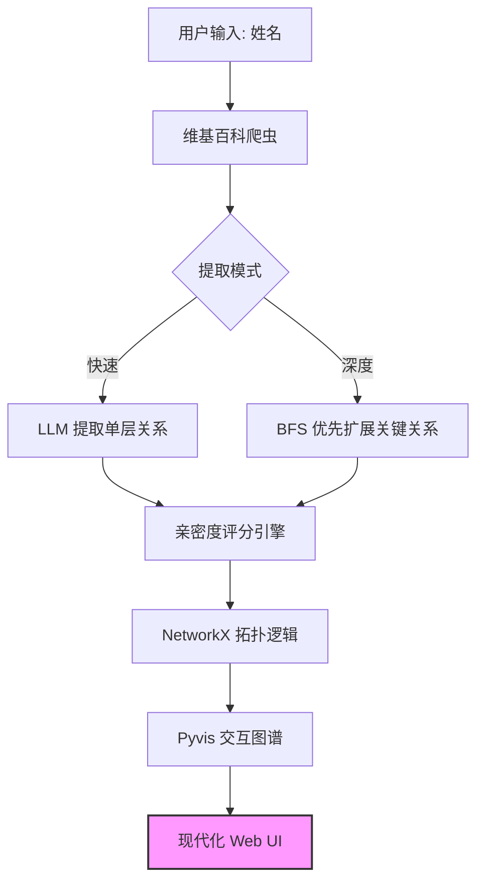
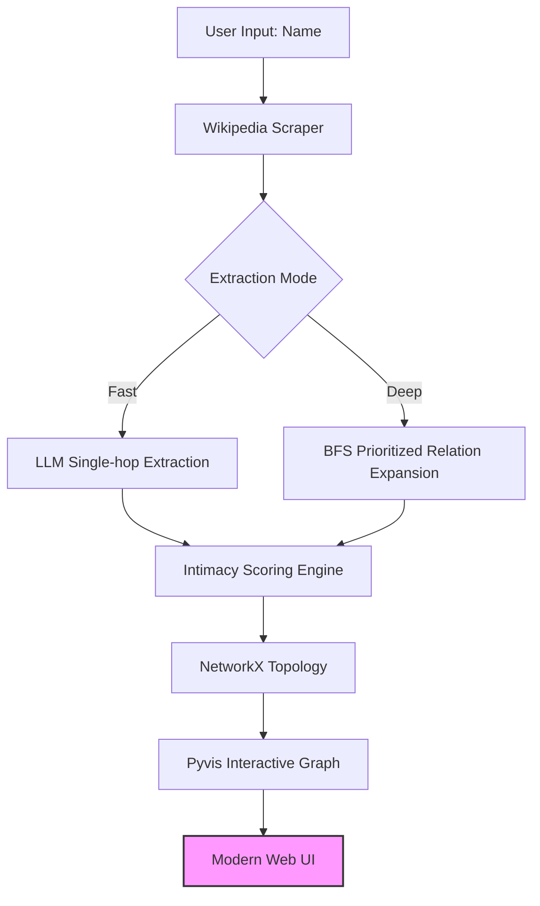

# 🎭 名人关系图谱｜Celebrity Relations Graph

<p align="center">
  <a href="#简体中文">简体中文</a> | <a href="#english">English</a>
</p>

<p align="center">
  
  
  
  
</p>

---

<h2 id="简体中文">🇨🇳 简体中文</h2>

<p align="center">
  <strong>一款基于大语言模型和广度优先搜索，自动提取并可视化社交网络的开源情报 (OSINT) 工具。</strong>
</p>

### 🌟 项目概览

**Celebrity Relations Graph** 是一个智能管道，旨在绘制公众人物复杂的社交网络。通过利用 **大语言模型 (LLM)** 进行实体关系提取，并结合 **广度优先搜索 (BFS)** 进行多跳发现，它将非结构化的传记文本转化为高保真、交互式的知识图谱。

该工具超越了简单的关键词匹配，利用 AI 理解人际关系的细微差别和亲密程度。

### 🚀 核心特性

- **🧠 智能提取**：深度解析非结构化文本，利用尖端 LLM 识别 `(主体, 关系, 客体)` 三元组。
- **❤️ 亲密度评分**：专有的 LLM 驱动启发式算法（1-10 级）量化关系亲密度（例如，家人：10，熟人：2）。
- **🕸️ 动态爬虫**：支持多跳深度（“快速” vs “深度”模式）以揭示“网络背后的网络”。
- **🎨 磨砂玻璃 UI**：现代化的、基于物理模拟的可视化看板，支持实时日志流展示。

### 🆕 最新技术更新

1. **智能人物解析**：先通过 Wikipedia 搜索 API 匹配人物条目；中文姓名优先查询中文百科。遇到 API 限流时会自动降级为直达页面，再回退到网页搜索。
2. **可信关系抽取**：模型只保留资料中直接支持的具名人物关系，并自动校验、规范化与去重结果。
3. **优先级深度搜索**：深度模式会优先沿亲属、伴侣与高可信合作关系扩展，减少低价值节点带来的噪声。
4. **关系强度可视化**：核心人物以金色突出；连线粗细与节点尺寸会根据亲密度评分 (1-10) 动态缩放。

### 🏗️ 技术架构


```mermaid
graph TD
    A[用户输入: 姓名] --> B[维基百科爬虫]
    B --> C{提取模式}
    C -- 快速 --> D[LLM 提取单层关系]
    C -- 深度 --> E[BFS 优先扩展关键关系]
    D --> F[亲密度评分引擎]
    E --> F
    F --> G[NetworkX 拓扑逻辑]
    G --> H[Pyvis 交互图谱]
    H --> I[现代化 Web UI]
    style I fill:#f9f,stroke:#333,stroke-width:2px
```

### 🔧 快速入门

#### 1. 安装
```bash
git clone https://github.com/zytjmy1/CelebrityRelationsGraph.git
cd CelebrityRelationsGraph
pip install -r requirements.txt
```

#### 2. 配置
在根目录创建 `.env` 文件：
```env
OPENAI_API_KEY=your_api_key_here
OPENAI_BASE_URL=https://api.deepseek.com/v1
OPENAI_MODEL_NAME=deepseek-v4-pro
DEFAULT_LANGUAGE=zh
```

#### 3. 使用
启动 Web 服务器：
```bash
python src/app.py
# Open http://127.0.0.1:8000
```

---

<h2 id="english">🇺🇸 English</h2>

<p align="center">
  <strong>An automated OSINT tool to extract and visualize social networks using Large Language Models and Breadth-First Search.</strong>
</p>

### 🌟 Overview

**Celebrity Relations Graph** is an intelligent pipeline designed to map the intricate social networks of public figures. By leveraging **Large Language Models (LLM)** for entity-relation extraction and **Breadth-First Search (BFS)** for multi-hop discovery, it transforms unstructured biography text into high-fidelity, interactive knowledge graphs.

### 🚀 Key Features

- **🧠 Intelligent Extraction**: Deeply parses unstructured text to identify `(Subject, Relation, Object)` triplets.
- **❤️ Intimacy Scoring**: A proprietary LLM-driven heuristic (scale 1-10) to quantify relationship closeness.
- **🕸️ Dynamic Crawler**: Supports multi-hop depth ("Fast" vs "Deep" mode).
- **🎨 Glassmorphism UI**: A modern, physics-based visualization dashboard.

### 🆕 Recently Updated Technologies

1. **Smart Name Resolution**: Resolves people through Wikipedia search, prioritizes Chinese Wikipedia for Chinese names, and falls back to direct pages and web search when necessary.
2. **Grounded Relationship Extraction**: Keeps only named-person relationships directly supported by retrieved source text, then validates and de-duplicates them.
3. **Prioritized Deep Search**: Expands family, partner, and high-confidence collaboration links first to keep multi-hop graphs useful.
4. **Visual Intimacy Engine**: Highlights the focal person and dynamically scales nodes and edges by intimacy.

### 🏗️ Technical Architecture


```mermaid
graph TD
    A[User Input: Name] --> B[Wikipedia Scraper]
    B --> C{Extraction Mode}
    C -- Fast --> D[LLM Single-hop Extraction]
    C -- Deep --> E[BFS Prioritized Relation Expansion]
    D --> F[Intimacy Scoring Engine]
    E --> F
    F --> G[NetworkX Topology]
    G --> H[Pyvis Interactive Graph]
    H --> I[Modern Web UI]
    style I fill:#f9f,stroke:#333,stroke-width:2px
```

### 🔧 Getting Started

#### 1. Installation
```bash
git clone https://github.com/zytjmy1/CelebrityRelationsGraph.git
cd CelebrityRelationsGraph
pip install -r requirements.txt
```

#### 2. Configuration
Create a `.env` file:
```env
OPENAI_API_KEY=your_api_key_here
OPENAI_BASE_URL=https://api.deepseek.com/v1
OPENAI_MODEL_NAME=deepseek-v4-pro
DEFAULT_LANGUAGE=en
```

#### 3. Usage
```bash
python src/app.py
# Open http://127.0.0.1:8000
```

---

<p align="center"> Designed with ❤️ for the OSINT Community </p>
